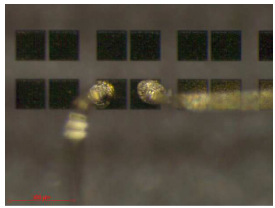

## SINONGAN - Modification of properties of two-dimensional electronic gas using insitu surface passivation of AlGaN/GaN heterostructures by molecular beam epitaxy

### Project Information
* Date: Apr 2014 - Apr 2016
* Funded by: TUBITAK / RFBR of Russia (Joint Project)
* Number: 113F364
* Budget: 282 910 Turkish liras

### Project Description

Abstract

In recent years, the implementation of III–V-nitride compound semiconductors into optoelectronic and electronic devices has become an impressive success story. In the development of this very successful technology, the knowledge basis for the application of wurtzite nitride heterostructures to advanced optical and electronic devices requires an understanding of the electronic properties of their surface and interfaces and also their interplay with the polarization charges at the heterojunctions, which characterize the wurtzite III-N heterostructures as compared with the classical zincblende III–V ones. A number of problems still hamper further development most notably, a lack of understanding of the origin and ensuing lack of control of the two-dimensional electron gas (2DEG) in undoped AlGaN/GaN heterostructures and the phenomenon of current collapse in high-frequency transistor devices, which may result in issues related to noise, power loss, and reliability. Among several mechanisms, the most widely accepted one is that the 2DEG originates from donor states on the AlGaN surface, moreover, surface states are responsible for current degradation of transistor devices. Much attention has been focused on the reduction of parasitic surface states using different passivation dielectrics, the one of the most promising one is the SiN in situ grown by molecular beam epitaxy (MBE) without exposing the semiconductor surface to the air environment. However, in spite of demonstration of encouraging effectiveness of in situ SiN passivation its mechanisms is ill understood. 

We propose a two-year international collaboration project on investigation of mechanisms of in situ surface passivation of AlGaN/GaN heterostructures with 2DEG by molecular beam epitaxy. The collaboration consists of a research team led by Prof. Dr. K.S.Zhuravlev in Rzhanov Institute of Semiconductor Physics (Novosibirsk, Russia) and a team led by Assoc. Prof. Dr. S. B.Lisesivdin in Gazi University (Ankara, Turkey).

### Objectives

Objectives of the theoretical study:

* Investigation of dielectric constants of SiN material by DFT methods,
* Investigation of the effects of impurities that may occur in the SiN material to be grown in situ by the MAE method on the electronic and optical properties of the SiN material,
* Examining the effects of impurities on the optical properties and dielectric constants, and their effects on its use in a transistor structure in general,
* Simulating the dielectric parameters of the obtained SiN material as a transistor using the solution of 2-dimensional self-consistent Schrödinger-Poisson equations in which thermal, stress and polarization effects are included,
* It is aimed to propose possible patentable designs in transistor production by examining parameters such as IDS-VDS, IDS-VGS and transistor conductivity of the simulated transistors.

Objectives of the experimental study:

* The change of parameters such as mobility and carrier density of 2BEG formed in the structure by using different SiN growths or barrier structures with different alloy ratio or thickness will be examined,
* Determination of parasitic transmission channels that may occur in addition to 2BEG by applying methods such as Quantitative Mobility Spectrum Analysis (NDSA – Eng. QMSA) or Simple Parallel Transmission Extraction Method (BPIAY – Eng. SPCEM),
* Examination of electron-phonon interactions that may occur at high electron temperatures in structures related to hot-electron dynamics measurements measured with high voltage pulse signals at low temperatures (it is an important research area for microwave transistors, which are used in military and satellite communication applications where they are expected to operate at high temperatures),
* Magnetoresistance measurements of 2BEG electrons in the related structures at low temperatures (~1.8K) and high magnetic fields (~11T) are made as a function of lattice temperature by applying a low electric field that does not heat the electrons,
* Calculating the effective mass of two-dimensional (2D) electrons and the Dingle temperature from the variation of the amplitude of the SdH oscillations with temperature and magnetic field,
* Determination of the relevant structures, Fermi energy, carrier density and transport mobility of 2D electrons using Hall voltage measurements with the period of SdH oscillations,
* Obtaining information about the bond structure and effective mass of the produced crystals by using the Raman spectrum,
* It is aimed to examine its optical properties with the photoluminescence system.

### Project Consortium

#### Project Team
* Assoc. Prof. Dr. Sefer Bora Lisesivdin (PI) (Gazi Univ.)
* Prof. Dr. Engin Tiras (Anadolu Univ.)
* Prof. Dr. Konstantin S. Zhuravlev (Rzhanov Institute)
* Dr. Vladimir Gennadievich Mansurov (Rzhanov Institute)

#### Other Colleagues, Students and Collaborations
* Prof. Dr. Ekmel OZBAY (Bilkent Univ.)
* Prof. Dr. Mehmet KASAP (Gazi Univ.)
* Timur Valerevich Malin (Rzhanov Institute)
* Gokhan ATMACA (Gazi Univ.)
* Sukru ARDALI (Anadolu Univ.)

### Project Structure
* WP2: DFT-coupled Device Simulations
* WP3: Wide temperature range electrical measurements
* WP4: Quantum Hall Effect and Optical Measurements

### Project News*

#### April 2016
Project is finished.

#### April 2014
Project is started.

*: Project site is prepared after project was finished.
